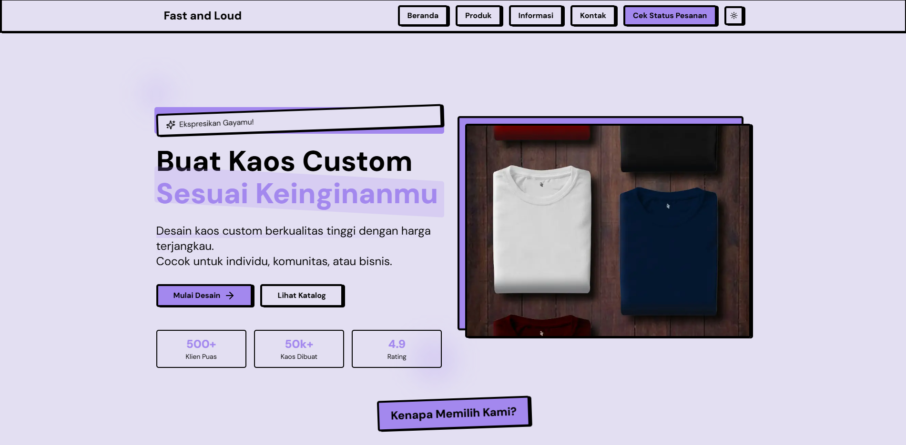

# Fast and Loud - Custom T-Shirt Landing Page

https://profile-page-clothing-business.vercel.app/



Fast and Loud adalah landing page untuk bisnis custom t-shirt yang dibangun menggunakan Next.js dan mengusung tema neobrutalism. Website ini dirancang untuk memberikan pengalaman pengguna yang menarik dengan desain yang unik dan modern.

## Fitur Utama

- 🎨 Desain Neobrutalism yang unik dan eye-catching
- 📱 Responsif untuk semua ukuran layar
- 🌓 Mode gelap/terang
- ⚡ Performa optimal dengan Next.js
- 🎯 Fokus pada konversi dengan CTA yang strategis
- 💅 Styling menggunakan Tailwind CSS

## Halaman yang Tersedia

- 🏠 Beranda - Showcase produk dan layanan utama
- 👕 Produk - Katalog lengkap produk custom
- ℹ️ Informasi - Panduan pemesanan dan FAQ
- 📞 Kontak - Informasi kontak dan lokasi workshop
- 📦 Status Pesanan - Tracking pesanan customer

## Cara Memulai

Website ini menggunakan `pnpm` sebagai package manager. Pastikan Anda telah menginstal `pnpm` sebelum memulai.

### Instalasi

```bash
# Install dependencies
pnpm i

# Jalankan development server
pnpm run dev
```

### Konfigurasi

- Ubah metadata di `layout.tsx`
- Update `favicon.ico`
- Sesuaikan konten di setiap halaman

### Struktur Konten

Semua konten dipisahkan dalam section yang terorganisir untuk memudahkan pengeditan:
- Hero Section
- Features Section
- Business Solutions
- Process Section
- Testimonials
- CTA Section

### Styling

Untuk mengubah styling, kunjungi [dokumentasi styling](https://neobrutalism-components.vercel.app/docs/styling) dan terapkan gaya yang diinginkan ke konfigurasi tailwind sesuai dengan panduan yang ada di dokumentasi.

## Teknologi yang Digunakan

- Next.js 14
- TypeScript
- Tailwind CSS
- Lucide Icons
- Radix UI
- Next Themes
